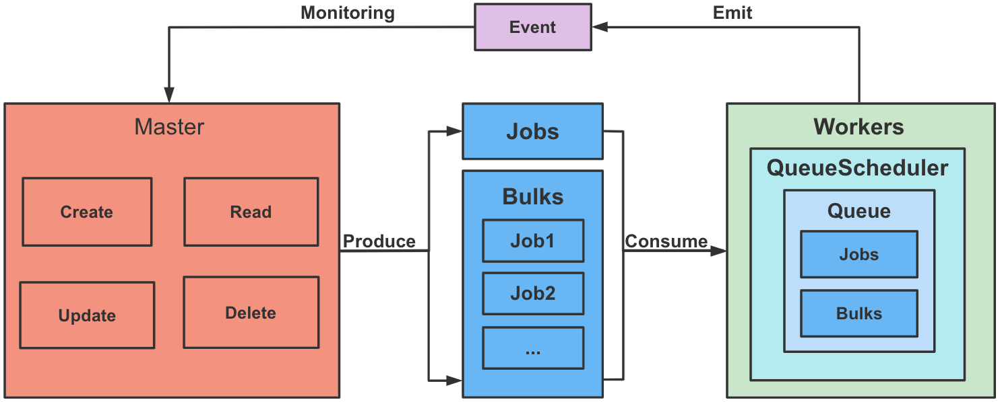
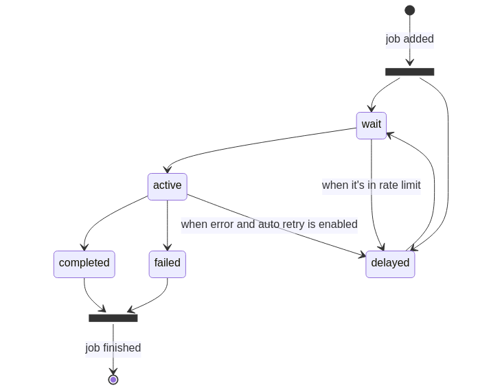

<h1 align="center">Job Scheduler</h1>
<p align="center">The goal of this project is to design a job scheduler that we can use to dynamically schedule different jobs.</p>
<div align="center"></div>

## Architecture

This project is a Redis-based distributed queue for job scheduler based in 6 classes that together can be used to resolve many different problems. These classes are Queue, Worker, QueueScheduler, QueueEvents,Job and Bulk.


#### Queue

The first class you should know about is the Queue class. This class represents a queue and can be used for adding jobs to the queue as well as some other basic manipulation such as adding,updting,removing or getting data from the queue.
Queues can hold different types of jobs which determine how and when they are processed.

#### Job

Jobs are basically a user created data structure that can be stored in the queue. Jobs are processed by workers.
All jobs need to have a unique job id. These id is used to store construct a key where the data is stored in Redis and as a pointer to the job as it is being moving around the different states it can be during its lifetime.



#### Bulk

Sometimes it is necessary to add a complete bulk of jobs atomically. For example, there could be a requirement that all the jobs must be placed in the queue or none of them. Also, adding a bulk of jobs can be faster since it reduces the roundtrips to Redis.

#### Work

Workers are instances capable of processing jobs. You can have many workers, either running in the same Node.js process, or in separate processes as well as in different machines. They will all consume jobs from the queue and mark the jobs as completed or failed.

#### QueueScheduler

The QueueScheduler is a helper class used to manage stalled and delayed jobs for a given Queue.This class automatically moves delayed jobs back to the waiting queue when it is the right time to process them.

#### QueueEvents

All classes emit useful events that inform on the lifecycles of the jobs that are running in the queue. Every class is an EventEmitter and emits different events.

## Getting started

Download the source code and running the following command at the root of the package:

```shell
# install package
yarn install
# compile and buld the project of typescript
yarn build
# start the docker contain of Redis
yarn dc:up
# test all the test cases in the tests folder
yarn test
```

> Make sure you are using the original npm registry.  
> `npm config set registry http://registry.npmjs.org`

## Dependencies

Either make sure you're running a version of node compliant with the `engines` requirement in `package.json`, or install Node Version Manager [`nvm`](https://github.com/creationix/nvm) and run `nvm use` to use the correct version of node.

Requires `nodejs` ,`yarn` , `npm` , `docker` and `docker-compose`.

```shell
# node -v
v16.0.0
# yarn version
yarn version v1.22.17
# npm -v
8.5.3
# docker -v
Docker version 20.10.12, build e91ed57
# docker-compose -v
docker-compose version 1.29.2, build 5becea4c
```

## Tasks

#### 1.Create/Read/Update/Delete jobs to run

run tests/job.test.ts to implement the functions.

```shell
# rest result
$ ts-mocha -p tsconfig-cjs.json --config ./.mocharc.js tests/job.test.ts


  Job
    ✓ read
    ✓ update
    ✓ remove


  3 passing (59ms)

```

#### 2.Supports one time execution and repetitive executions triggered at a fixed interval, i.e. 10 seconds.

run tests/repeat.test.ts to implement the functions.

```shell

# rest result
$ ts-mocha -p tsconfig-cjs.json --config ./.mocharc.js tests/repeat.test.ts


  repeat
    ✓ should repeat every 10 seconds and start immediately (88ms)


  1 passing (110ms)

```

#### 3.Jobs are persisted

Redis is considered more a speedy cache instead of a database that guarantees data consistency. Persistence refers to the writing of data to durable storage, such as a solid-state disk (SSD). Redis itself provides a range of persistence options:RDB (Redis Database),AOF (Append Only File) and RDB + AOF.

the sample of Redis keys as follows:

```shell
127.0.0.1:6379> keys *
1) "job-scheduler:test-03f10ee1-b972-48ba-97b6-7c2ca29bff80:completed"
2) "job-scheduler:test-03f10ee1-b972-48ba-97b6-7c2ca29bff80:events"
3) "job-scheduler:test-03f10ee1-b972-48ba-97b6-7c2ca29bff80:1"
4) "job-scheduler:test-03f10ee1-b972-48ba-97b6-7c2ca29bff80:meta"
5) "job-scheduler:test-03f10ee1-b972-48ba-97b6-7c2ca29bff80:2"
6) "job-scheduler:test-03f10ee1-b972-48ba-97b6-7c2ca29bff80:id"
```

#### 4.The system is scalable to thousands of jobs and many workers

run tests/multipleWorks.test.ts to show it easy to add new works.

the test result is :

```shell
$ ts-mocha -p tsconfig-cjs.json --config ./.mocharc.js tests/multipleWorks.test.ts

  multiple workers
    ✓ should process jobs (329ms)

```

when you what to add new workers:

```shell
const worker1 = new Worker(queueName, processor1, { connection });
await worker1.waitUntilReady();

const worker2 = new Worker(queueName, processor2, { connection });
await worker2.waitUntilReady();
```

#### 5.Monitoring such as timeout detection？

run tests/monitor.test.ts to monitor task status by queueEvents.

the test result is :

```shell
$ ts-mocha -p tsconfig-cjs.json --config ./.mocharc.js tests/monitor.test.ts


  monitor
    ✓ should process a delayed job only after delayed time (1238ms)

  1 passing (1s)

```

Monitor the task is delayed:

```shell
const delayed = new Promise<void>(resolve => {
  queueEvents.on('delayed', () => {
    publishHappened = true;
    resolve();
  });
});
```

#### 6.Retry, maybe?

run tests/retry.test.ts to retry jobs with queueScheduler.

the test result is :

```shell
$ ts-mocha -p tsconfig-cjs.json --config ./.mocharc.js tests/retry.test.ts


  retry
retry times : 1
retry times : 2
retry times : 3
    ✓ should retry a job after a delay if a fixed backoff is given (55ms)

```

retry the job:

```shell
const worker = new Worker(
  queueName,
  async job => {
    console.log('retry times :', job.attemptsMade);
    retryTimes++;
    if (job.attemptsMade < 3) {
      throw new Error('Not yet!');
    }
  },
  { connection },
);
```

#### 7.For scalability, you can provide justification why your design would be feasible.

For scalability:

- Easy to scale horizontally. Add more workers for processing jobs in parallel.
- Compared to a relational database is the fact that key-value stores (Redis) are infinitely scalable in a horizontal fashion. Compared to relational databases where expansion is vertical and finite, this can be a big boon to complex and larger databases.
- Provides rate limiting for the queues. It is possible to configure the workers so that they obey a given rate limiting option:

```shell
const worker = new Worker('painter', async job => paintCar(job), {
  limiter: {
    max: 10,
    duration: 1000
  }
});
```

#### 8.For the exercise, please dockerize everything.

docker command as follows:

```shell
# start the docker contain of Redis
yarn dc:up

# stop the docker contain of Redis
yarn dc:down

```

> Due to time constraints, the main program is not build as docker image yet.
